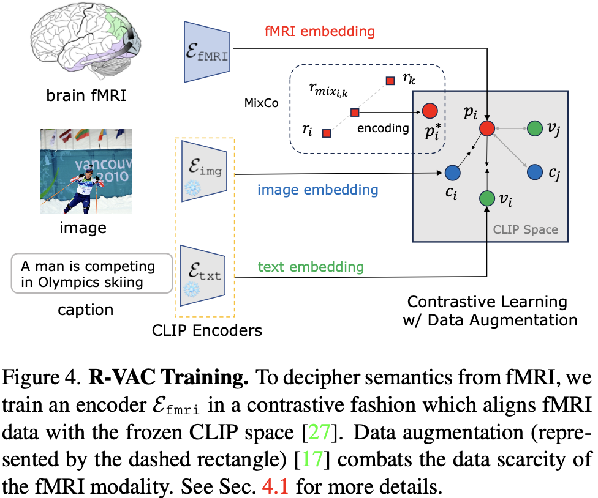
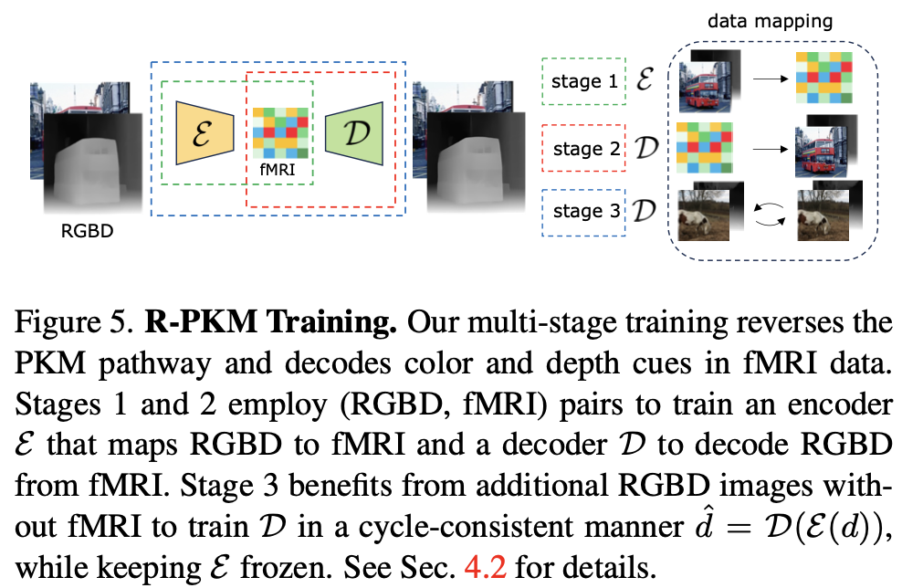
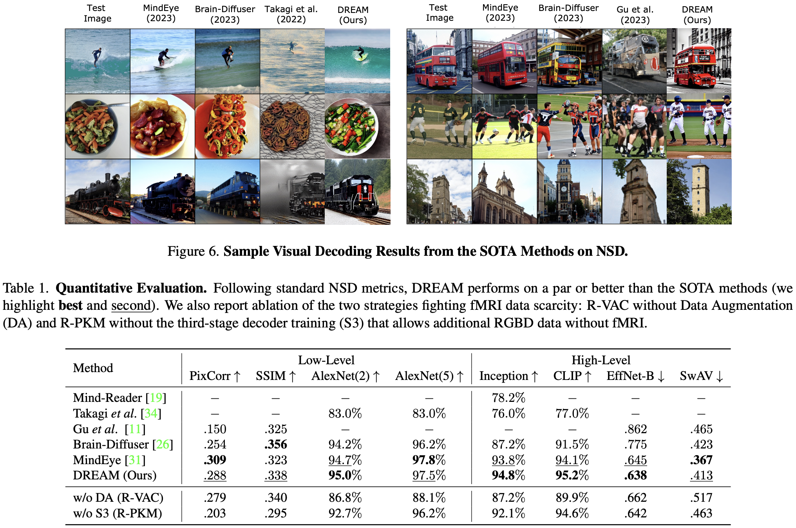
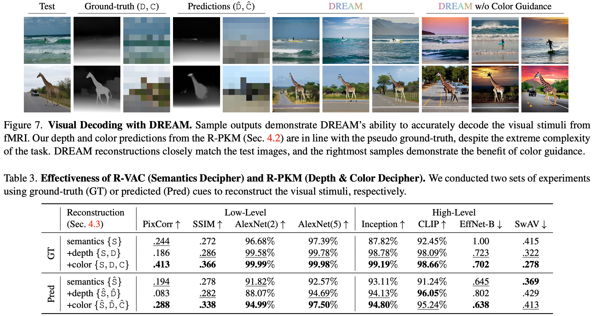

# DREAM: 仿生的视觉解码

Author: <a href="https://yusijin02.github.io/">Sijin Yu</a>

> **标题**: DREAM: Visual Decoding from REversing HumAn Visual SysteM
>
> **会议/期刊**: WACV 2024
>
> **GitHub**: https://github.com/weihaox/DREAM

[TOC]

## 1. Abstract

- 在这项工作中, 我们提出了 DREAM, 一种从脑部活动重建所观看图像的功能磁共振成像 (fMRI) 方法, 这一方法基于对人类视觉系统的基本认识.
- 我们设计了**模仿人类感知视觉世界的层级**和**并行特性的逆向路径**.
- 这些定制的路径专门用于从功能磁共振成像 (fMRI) 数据中解码语义、颜色和深度线索, 反映了从视觉刺激到功能磁共振成像记录的前向路径.
- 为此, 两个组件模仿了人类视觉系统内的逆过程: **逆向视觉联合皮层 (Reverse Visual Association Cortex, R-VAC)** 逆转了这个大脑区域的路径, 从功能磁共振成像 (fMRI) 数据中提取语义信息; **逆向并行PKM (Reverse Parallel PKM, R-PKM)** 组件同时从功能磁共振成像信号中预测颜色和深度.
- 实验表明, 与目前最先进的模型相比, 我们的方法在外观、结构和语义的一致性方面表现更佳.

## 2. Motivation & Contribution

### 2.1 Motivation

- 当前视觉解码领域 (即将功能磁共振成像 (fMRI) 数据解码为测试图像) 取得了显著进展, 这有助于深入了解大脑功能.
- 尽管如此, 现有方法在图像结果的概念完整性和质量上仍存在不足.
- 现有的基于深度生成模型的视觉解码方法主要依赖于将脑信号与视觉-语言模型对齐, 但这些方法缺乏对人类视觉系统的洞察.
- 现有方法的局限性在于它们未能有效保留场景的结构和位置信息, 且缺乏从人类视觉系统中汲取的见解.

### 2.2 Contribution

- 提出了一种新颖的视觉解码方法 **DREAM (从人类视觉系统逆向工作的视觉解码方法)**, 该方法基于人类感知原则, 旨在解决信息转换过程中的潜在信息丢失问题.
- DREAM 方法通过设计两个逆向路径, 专门用于从 fMRI 数据中提取语义、颜色和深度信息, 从而模仿视觉刺激到 fMRI 记录的前向过程.
- 通过实验验证, DREAM 方法在外观、结构和语义的一致性方面优于现有最先进的方法, 更好地维持了生物学上的可解释性.

## 3. Methods

### 3.1 人类视觉系统 (Human Visual System, HVS)

- 从视网膜到大脑的连接可以分为**视盘细胞通路 (Parvocellular Pathway)** 和**视杆细胞通路 (Magnocellular Pathway)**.
- 视盘细胞通路源自视网膜上的侏儒细胞, 负责传输颜色信息.
- 视杆细胞通路始于伞形细胞, 专门用于检测深度和运动.
- 视觉信息首先被引导到称为丘脑外侧膝状体 (LGN) 的感觉中继站, 然后传送到视觉皮层 (V1) 进行视觉刺激的初步处理.
- 视觉联合皮层 (VAC) 接收来自V1的处理信息, 并进行高级语义内容的复杂处理.

### 3.2 [语义解读] 反视觉皮层 (R-VAC)

主要包括两点: **对比学习**和**数据增强**

- **对比学习**

  - 从 CLIP 里偷走 text encoder ($\mathcal E_{\text{txt}}$) 和 image encoder ($\mathcal E_{\text{img}}$), 并且 frozen.

  - 训练 fMRI encoder ($\mathcal E_{\text{fMRI}}$).

  - 令 fMRI, text, img 的 embeddings 分别表示为 $p$, $c$, $v$. 则对比学习损失函数为:
    $$
    \mathcal L_p = -\log\frac{\exp(p_i\cdot c_i/\tau)}{\sum_{j=0}^K\exp(p_i\cdot c_j/\tau)}-\log\frac{\exp(p_i\cdot v_i/\tau)}{\sum_{j=0}^K\exp(p_i\cdot v_j/\tau)}
    $$
    其中, $\tau$ 表示温度系数, $K$ 表示负样本数量, 这本质上是 $(K+1)$-way softmax-based classifier.

- **数据增强**

  - fMRI 只有 $\approx 10^4$ 的样本, 训练 CLIP 的样本数接近 $\approx 10^8$, 这可能破坏对比学习, 因此引入 MixCo 数据增强.

  - 从两个 fMRI 数据 $r_i$ 和 $r_k$ 中生成混合后的 fMRI 数据 $r_{\text{mix}_{i, k}}$:
    $$
    r_{\text{mix}_{i, k}}=\lambda_i\cdot r_i+(1-\lambda_i)r_k
    $$

  - 数据增强后的对比学习损失函数为:
    $$
    \begin{align}
    \mathcal L_{\text{MixCo}}=-\lambda_i&\left[-\log\frac{\exp(p_i^*\cdot c_i/\tau)}{\sum_{j=0}^K\exp(p_i^*\cdot c_j/\tau)}-\log\frac{\exp(p_i^*\cdot v_i/\tau)}{\sum_{j=0}^K\exp(p_i^*\cdot v_j/\tau)}\right]\\
    -(1-\lambda_i)&\left[-\log\frac{\exp(p_i^*\cdot c_k/\tau)}{\sum_{j=0}^K\exp(p_i^*\cdot c_j/\tau)}-\log\frac{\exp(p_i^*\cdot v_k/\tau)}{\sum_{j=0}^K\exp(p_i^*\cdot v_j/\tau)}\right]
    \end{align}
    $$
    其中, $p_i^*$ 是 $r_{\text{mix}_{i, k}}$ 的 embedding, 即 $p_i^*=\mathcal E_{\text{fMRI}}(r_{\text{mix}_{i, k}})$.

  - 两个损失通过超参数加权
    $$
    \mathcal L_{\text{totcal}}=\mathcal L_p+\alpha\mathcal L_{\text{MixCo}}
    $$

### 3.3 [深度和颜色解读] 反视盘视杆 (R-PKM)

- **问题定义**: 将问题定义为 RGBD 的重建, RGDB 通过 encoder 变为 fMRI, 然后通过 decoder 重建为 RGBD

- **数据构造**:

  - **颜色**: 将图像 x64 下采样, 然后将其变回原来的形状
  - **深度**: 使用模型 MiDaS 预测深度

- **第一阶段**: 训练 encoder ($\mathcal E$), RGBD $\to$ fMRI, 令真实的 fMRI 为 $r$, 预测的为 $\hat r$, 则损失函数:
  $$
  \mathcal L_r(r, \hat r)=\beta\cdot \text{MSE}(r, \hat r) - (1-\beta)\cos(\measuredangle (r, \hat r))
  $$

​	其中, $\beta$ 是超参数.

- **第二阶段**: 训练 decoder ($\mathcal D$), fMRI $\to$ DRGB, 令真实的 RGBD 为 $d$, 预测的为 $\hat d$, 则损失函数:
  $$
  \mathcal L_s(d, \hat d)=||d-\hat d||_1 +\mathcal J(\hat d)
  $$
  其中, $\mathcal J(\cdot)$ 是变分正则化, 即:
  $$
  \mathcal J(\hat d)=\iint \sqrt{(\partial_x \hat d)^2+(\partial_y\hat d)^2}\text dx\text dy
  $$

- **第三阶段**: encoder 被 frozen, 训练 decoder. 即 $\hat d=\mathcal D(\mathcal E(d))$.

### 3.4 Diffusion

fMRI embedding 作为条件引导, 颜色和深度使用 T2I-Adapter (<a href="https://yusijin02.github.io/notes-T2IAdapter/">我的另一篇博客</a>) 里的 color adapter 和 depth adapter 引入条件, 然后使用 Stable Diffusion.

## 4. Experiment

### 4.1 Dataset

- NSD

### 4.2 对比实验

### 4.3 消融实验

